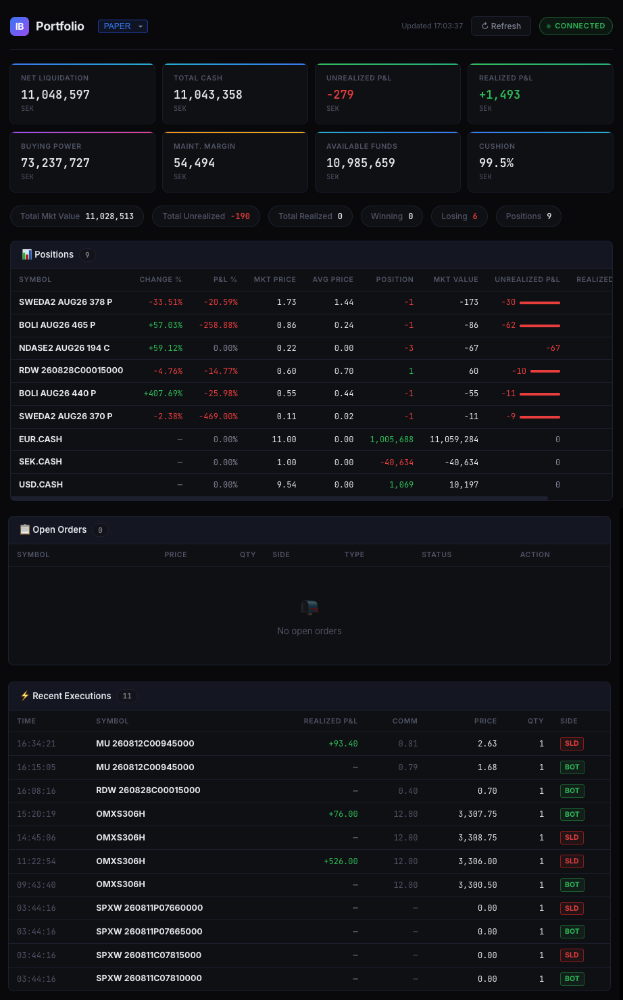

# IBKR Portfolio Dashboard

A lightweight, real-time, custom-built web dashboard for monitoring Interactive Brokers (IBKR) portfolios. This project interfaces directly with an active IBKR Gateway or TWS instance using `ib_async` and serves a clean, live-updating UI via FastAPI and WebSockets.



## 🚀 Why Re-Invent the Wheel?

You might wonder: _Why build a custom dashboard when IBKR provides the Mobile App, Web Portal, and TWS?_

While IBKR's official tools are powerful, they come with several limitations that this custom dashboard explicitly solves:

1. **Always-On, No 2FA Timeouts**: The IBKR Web Portal and Mobile App frequently log you out, requiring annoying 2FA re-authentication just to glance at your positions. This dashboard runs on top of a headless IB Gateway (or TWS) and provides an always-available local web interface. You can leave it open on a monitor all day without it ever expiring.
2. **Superior Options Strategy Grouping**: While IBKR sometimes struggles to cleanly display complex options combinations (like Credit Spreads or Iron Condors) in its lightweight apps, this dashboard natively detects, groups, and tracks custom combinations. It fixes notoriously annoying IBKR API quirks, such as the `28812380` "Unknown Symbol" bug for combo orders, and correctly calculates `Mkt Price`, `Avg Price`, and `Change %` for the entire strategy.
3. **Seamless Multi-Account Context**: Switch between your **Paper** and **Real** accounts instantly using a single unified interface without needing to log out and log back in.
4. **API Bot Synergy**: If you are running algorithmic trading scripts or API bots (e.g., automated futures trading), this dashboard natively integrates with the Gateway. It actively polls and broadcasts executions placed by _other_ API clients (using different `client_ids`), giving you a true, real-time reflection of your algorithmic executions—something the default apps often delay or obfuscate.
5. **Tailored UI/UX**: The UI is designed specifically for how _you_ trade. No cluttered menus, no unnecessary data points. Just your Positions, Open Orders, and Recent Executions, with customizable column ordering, automatic row highlighting, and instant live updates via WebSockets.

## ✨ Key Features

- **Real-Time Data**: Uses WebSockets to stream live `P&L`, `Market Value`, `Open Orders`, and `Recent Executions` straight to the browser with zero polling delay.
- **Smart Reconnection**: Automatically detects IBKR server disconnects (Error 1102) and silently refreshes all portfolio data (positions, open orders, executions) the moment connectivity is restored.
- **Cross-Client Execution Polling**: Actively polls `reqExecutionsAsync` to ensure trades executed by other API clients or automated bots appear instantly in your dashboard.
- **Advanced Combination Handling**: Properly resolves legs, prices, and changes for complex option combination orders, presenting them as cleanly nested expandable rows.
- **Fast & Responsive**: Built with Vanilla JS on the frontend and FastAPI on the backend. No heavy frontend frameworks to slow down rendering.

## 🛠 Tech Stack

- **Backend**: Python, [FastAPI](https://fastapi.tiangolo.com/), [ib_async](https://github.com/erdewit/ib_async) (for IBKR API communication).
- **Frontend**: Vanilla HTML/CSS/JS with Native WebSockets.
- **Server**: Uvicorn.

## ⚙️ Setup and Installation

### 1. Prerequisites

- Python 3.9+
- An active instance of **IBKR Trader Workstation (TWS)** or **IB Gateway** running locally or on your network.
- Make sure to uncheck **"Allow connections from localhost only"** in the IBKR API settings if you are connecting from a remote machine, and add your IP to the **Trusted IPs**.

### 2. Install Dependencies

```bash
python3 -m venv venv
source venv/bin/activate
pip install -r requirements.txt
```

### 3. Configuration

Copy the sample config file to create your own configuration:

```bash
cp config.json.sample config.json
```

Edit `config.json` to point to your IBKR Gateway's IP address, Ports, and Account IDs for both your Real and Paper accounts.

### 4. Run the Server

```bash
uvicorn main:app --host 0.0.0.0 --port 6001 --reload
```

## 📱 Usage

Once the server is running, simply navigate to:

- **Paper Account**: `http://localhost:6001/paper`
- **Real Account**: `http://localhost:6001/real`

The dashboard will automatically connect, subscribe to live market data, and stream updates directly to your screen.

## 📄 License

This project is licensed under the MIT License - see the [LICENSE](LICENSE) file for details.
